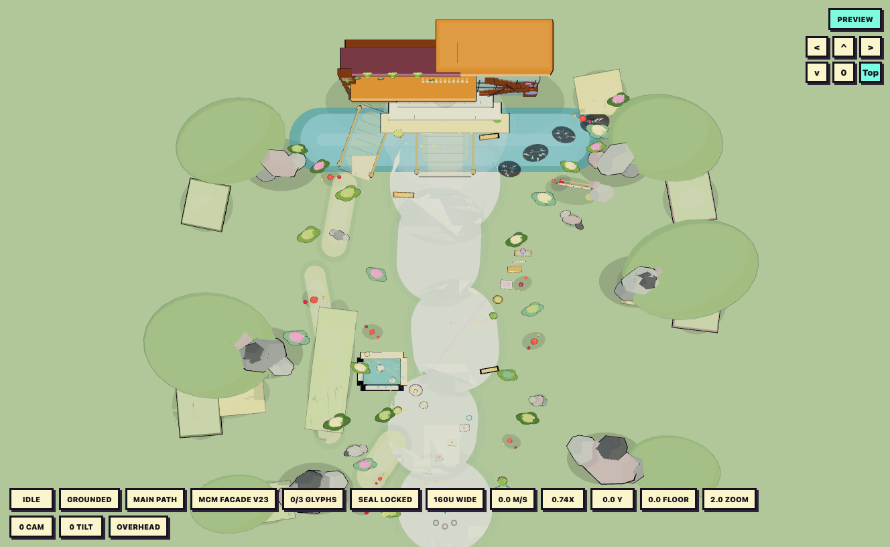

# Psychedelic Pogo Orb Control Room Vertical Slice

This package is a contained docs-only prototype for the Psychedelic Pogo Orb museum-grounds control room. It does not integrate with production gameplay, routes, experiment-lab, vacuum-lab, or slime-prototype.

## Run

From the repo root:

```bash
npx vite docs/asset-generation/preview/pogo-orb --host 127.0.0.1 --port 5178
```

Open:

- Control room: <http://127.0.0.1:5178/control.html>
- Asset preview: <http://127.0.0.1:5178/>

## Controls

- Move: `WASD` or arrow keys
- Run: hold `Shift`
- Jump: `Space`
- Reset avatar: `R`
- Rotate camera: drag the view or use the camera pad
- Zoom: mouse wheel
- Overhead map: `Top` camera button or `control.html?camera=overhead`
- Dev spawns: `?spawn=plaques`, `?spawn=pond`, `?spawn=vista`, `?spawn=sign`, `?spawn=steps`
- Dev state: `?glyphs=all` and `?h=18.8` can smoke-test the activated door seal

## Included Slice

- Playable Psychedelic Pogo Orb character with idle, walk, run, hop, forward-hop, and ledge-fall animation support.
- Large museum-grounds arena scaled around a tiny orb/enjoyable character.
- Broad curved promenade, oversized grass field, blue sky, fog, moat, bridge, forecourt, and museum facade blockout.
- Remodeled mid-century modern museum facade with asymmetrical teak roof slabs, stronger bevel/trim reads, mauve gallery wall paneling, glass stair atrium, planted fern column, layered double-door entry detail, upper ledge flower detail, door planters, clipped-corner M.o.B.A. yard sign, and canopy bulb rhythm.
- First objective loop with three museum glyphs, HUD progress, active/locked door seal state, and slice completion.
- Object-based platform routes: plaque-hop tutorial, pond stepping-stone loop, sign/planter climb, and door helper plinths.
- Route beacons, arrival objective sockets, color-coded route gates, benches, planters, and a climbable vista viewer so the objective loop reads from the normal follow camera.
- Subtle vista sightlines from the viewer toward the plaque, pond, sign, bridge, and door route so the level previews itself without readable text.
- Gameplay pond water boundary that pushes the avatar back to safe rim/stone surfaces instead of acting like a painted floor decal.
- Asymmetric route structure with a hidden left grove trail and a right moat-edge stepping-stone connector.
- Collision surfaces for the main path, bridges, forecourt, museum steps, and intended ledges.
- Continuous slope surfaces for grove/shelf/bank ramps, so walking uphill uses real changing ground height instead of fake platform steps.
- Rounded climb ramps and hoppable tops for appropriate-height amanita caps, soft bush crowns, and low decorative stone clusters.
- Solid blocker collision for giant rocks, facade masses, and oversized ornamental objects that are too tall or visually steep to climb.
- Deep chunky toon rocks, amanita mushroom patches, bushes, and terrain formations that work as scale anchors rather than flat decals.

## Reference

Current overhead map reference:



The current level model is `museum-scale-mcm-facade-v23`.

## Validation

Targeted lint command:

```bash
npx eslint docs/asset-generation/code-examples/PsychedelicPogoOrbAsset.example.tsx docs/asset-generation/preview/pogo-orb/control.tsx docs/asset-generation/preview/pogo-orb/main.tsx docs/asset-generation/preview/pogo-orb/export.tsx docs/asset-generation/preview/pogo-orb/arena/MuseumScalePathGrassArena.tsx docs/asset-generation/preview/pogo-orb/arena/MuseumScaleGameplayLayer.tsx --max-warnings=0
```

Smoke-test target:

```text
http://127.0.0.1:5178/control.html
```

Check that the control room loads without console errors, the overhead camera shows the full museum approach, the MCM facade reads as a low wide asymmetrical museum at the existing scale, the front stairs/doors/glass atrium/fern column/sign match the reference breakdown, route gates/objective sockets/vista viewer frame the three-glyph loop without cluttering the promenade, glyph progress updates once per glyph, `?glyphs=all&x=0&z=-520&h=18.8` activates/completes the door seal, pond water pushes to safe pond surfaces, giant rocks still block the avatar, low/medium props can be climbed or landed on, and the hidden grove/right stepping stones still read as optional connectors.
